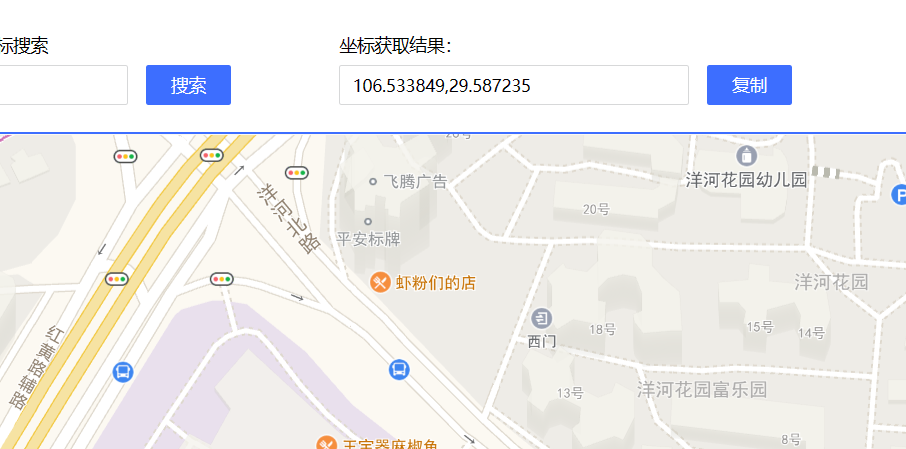
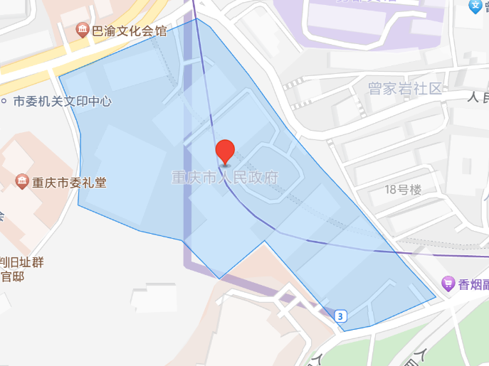

# 说明

1.  运行程序

1.  程序会轮询剪切板的值,你只需要复制上下左右最远的四个点的坐标,无需考虑顺序。 复制后无需操作,直接寻找下一个点,继续复制。

    

2.  复制完四个点后,回到高德地图用户版,截屏(alt+shift+s)蓝色区域。

    

3.  然后会弹出如上的窗口,你需要按顺序把点标出来,左键加点,右键撤销上一个加点。

4.  加点完成后按`ESC`,结果将被输出到标准输出中。

5.  你可以随便复制一行到开发版中根据坐标搜索来验证结果。

6.  所有的结果都被输出到标准输出了,你可以扩展这个程序,例如:

    1.  将结果顺便添加到excel
    2.  提前将若干张图的最低/最高点的坐标都放到excel中,让程序读取,运行时你只需要截图,并标点即可。

